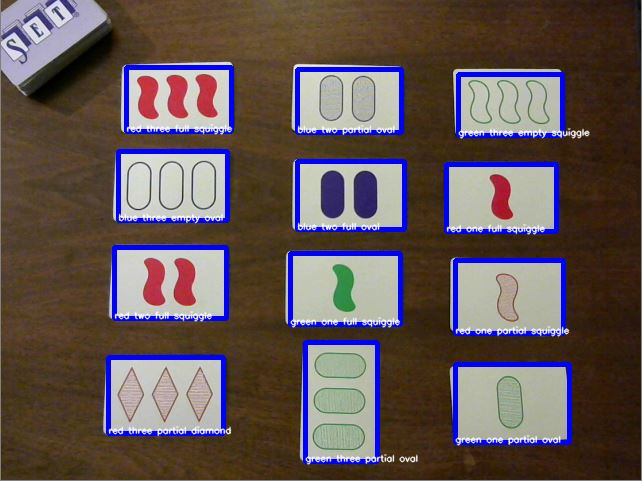

# SetAI  
An AI that can play the card game [Set](https://www.setgame.com/set) via webcam.  
Image processing and segmentation through OpenCV, neural network through Keras.  
(in active development)  

[This is a kernel](https://www.kaggle.com/kwisatzhaderach/setnet-trainer?scriptVersionId=19775002) demonstrating the network architecture and training method.  

Screenshots:  
  
  
